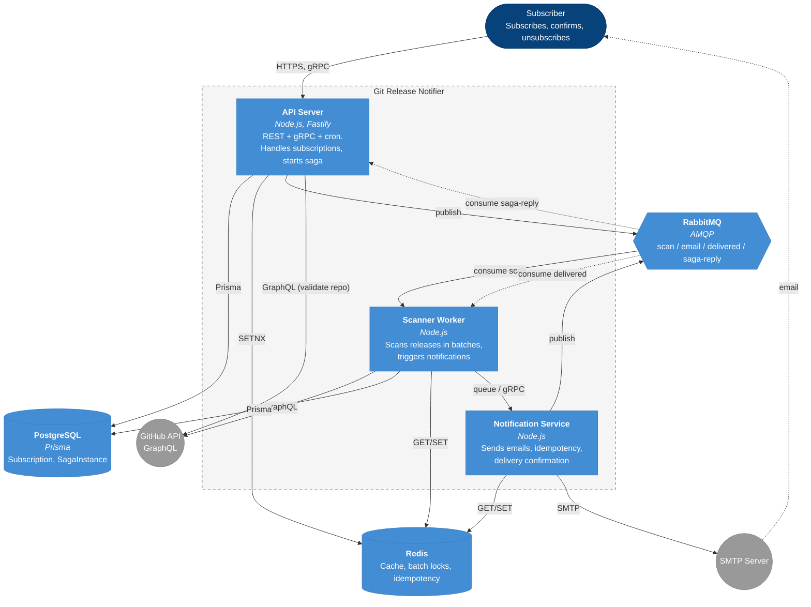

```mermaid
flowchart TB
    user(["Subscriber<br/>Subscribes, confirms, unsubscribes"])

    subgraph grn["Git Release Notifier"]
        direction TB
        api["<b>API Server</b><br/><i>Node.js, Fastify</i><br/>REST + gRPC + cron.<br/>Handles subscriptions, starts saga"]
        worker["<b>Scanner Worker</b><br/><i>Node.js</i><br/>Scans releases in batches,<br/>triggers notifications"]
        notify["<b>Notification Service</b><br/><i>Node.js</i><br/>Sends emails, idempotency,<br/>delivery confirmation"]
    end

    github(("GitHub API<br/>GraphQL"))

    pg[("<b>PostgreSQL</b><br/><i>Prisma</i><br/>Subscription, SagaInstance")]
    redis[("<b>Redis</b><br/>Cache, batch locks, idempotency")]
    mq{{"<b>RabbitMQ</b><br/><i>AMQP</i><br/>scan / email / delivered / saga-reply"}}
    smtp(("SMTP Server"))

    user -->|"HTTPS, gRPC"| api
    smtp -.->|"email"| user

    api -->|"Prisma"| pg
    api -->|"SETNX"| redis
    api -->|"publish"| mq
    api -->|"GraphQL (validate repo)"| github
    mq -.->|"consume saga-reply"| api

    mq -->|"consume scan"| worker
    worker -->|"GraphQL"| github
    worker -->|"Prisma"| pg
    worker -->|"GET/SET"| redis
    worker -->|"queue / gRPC"| notify
    mq -.->|"consume delivered"| worker

    notify -->|"GET/SET"| redis
    notify -->|"SMTP"| smtp
    notify -->|"publish"| mq

    classDef person fill:#08427B,stroke:#073B6F,color:#fff
    classDef container fill:#438DD5,stroke:#3C7FC0,color:#fff
    classDef db fill:#438DD5,stroke:#3C7FC0,color:#fff
    classDef queue fill:#438DD5,stroke:#3C7FC0,color:#fff
    classDef external fill:#999999,stroke:#8A8A8A,color:#fff
    classDef boundary fill:#f5f5f5,stroke:#666,stroke-dasharray: 5 5

    class user person
    class api,worker,notify container
    class pg db
    class redis db
    class mq queue
    class github,smtp external
    class grn boundary
```
