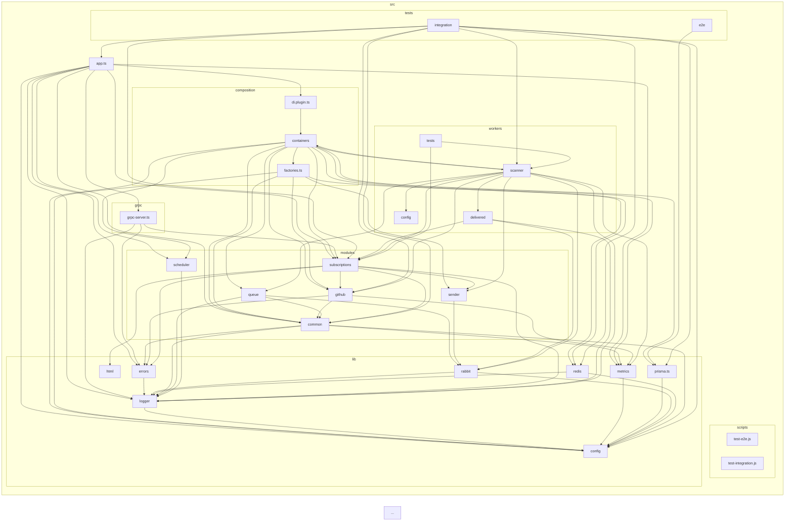

```mermaid

flowchart LR

subgraph 0["src"]
1["app.ts"]
subgraph 2["composition"]
3["containers"]
4["di.plugin.ts"]
5["factories.ts"]
end
subgraph 6["grpc"]
7["grpc-server.ts"]
end
subgraph 8["lib"]
9["config"]
A["errors"]
B["html"]
C["logger"]
D["metrics"]
E["prisma.ts"]
F["rabbit"]
G["redis"]
end
subgraph H["modules"]
I["common"]
J["github"]
K["queue"]
L["scheduler"]
M["sender"]
N["subscriptions"]
end
subgraph O["scripts"]
P["test-e2e.js"]
Q["test-integration.js"]
end
subgraph R["tests"]
S["e2e"]
T["integration"]
end
subgraph U["workers"]
V["config"]
W["delivered"]
X["scanner"]
Y["tests"]
end
end
1-->4
1-->7
1-->9
1-->A
1-->C
1-->D
1-->I
1-->L
1-->N
3-->D
3-->E
3-->G
3-->I
3-->K
3-->L
3-->N
3-->5
3-->9
3-->J
3-->X
4-->3
5-->9
5-->G
5-->I
5-->J
5-->M
7-->A
7-->C
7-->N
A-->C
C-->9
D-->9
E-->9
F-->9
F-->C
G-->9
G-->C
I-->C
I-->D
I-->9
I-->A
J-->A
J-->D
J-->I
K-->F
K-->C
K-->I
L-->C
M-->F
N-->J
N-->A
N-->C
N-->M
N-->B
N-->I
S-->E
T-->1
T-->E
T-->G
T-->I
T-->9
T-->J
T-->N
T-->X
W-->C
W-->F
W-->N
X-->J
X-->M
X-->N
X-->D
X-->C
X-->F
X-->K
X-->V
X-->3
X-->W
Y-->N
Y-->X

...
```
