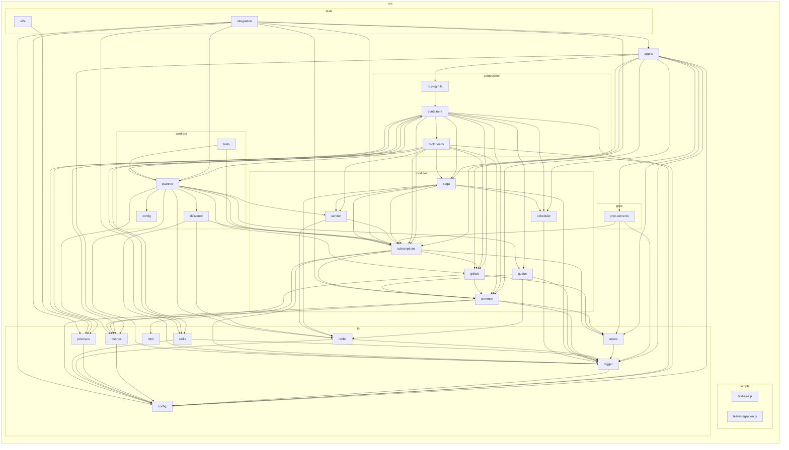

```mermaid

flowchart LR

subgraph 0["src"]
1["app.ts"]
subgraph 2["composition"]
3["containers"]
4["di.plugin.ts"]
5["factories.ts"]
end
subgraph 6["grpc"]
7["grpc-server.ts"]
end
subgraph 8["lib"]
9["config"]
A["errors"]
B["html"]
C["logger"]
D["metrics"]
E["prisma.ts"]
F["rabbit"]
G["redis"]
end
subgraph H["modules"]
I["common"]
J["github"]
K["queue"]
L["saga"]
M["scheduler"]
N["sender"]
O["subscriptions"]
end
subgraph P["scripts"]
Q["test-e2e.js"]
R["test-integration.js"]
end
subgraph S["tests"]
T["e2e"]
U["integration"]
end
subgraph V["workers"]
W["config"]
X["delivered"]
Y["scanner"]
Z["tests"]
end
end
1-->4
1-->7
1-->9
1-->A
1-->C
1-->D
1-->I
1-->L
1-->M
1-->O
3-->D
3-->E
3-->G
3-->I
3-->K
3-->L
3-->M
3-->O
3-->5
3-->9
3-->J
3-->Y
4-->3
5-->9
5-->E
5-->G
5-->I
5-->J
5-->L
5-->N
5-->O
7-->A
7-->C
7-->O
A-->C
C-->9
D-->9
E-->9
F-->9
F-->C
G-->9
G-->C
I-->C
I-->D
I-->9
I-->A
J-->A
J-->D
J-->I
K-->F
K-->C
K-->I
L-->C
L-->N
L-->O
L-->M
L-->F
M-->C
N-->O
N-->F
O-->J
O-->A
O-->C
O-->L
O-->B
O-->I
T-->E
U-->1
U-->E
U-->G
U-->I
U-->9
U-->J
U-->O
U-->Y
X-->C
X-->F
X-->O
Y-->J
Y-->N
Y-->O
Y-->D
Y-->C
Y-->F
Y-->K
Y-->W
Y-->3
Y-->X
Z-->O
Z-->Y

```
