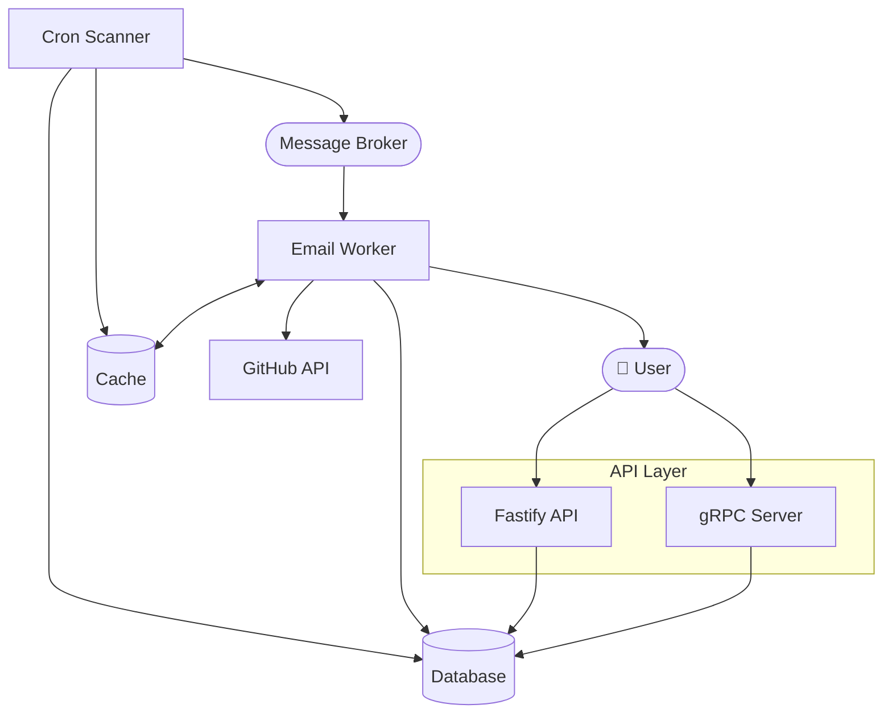
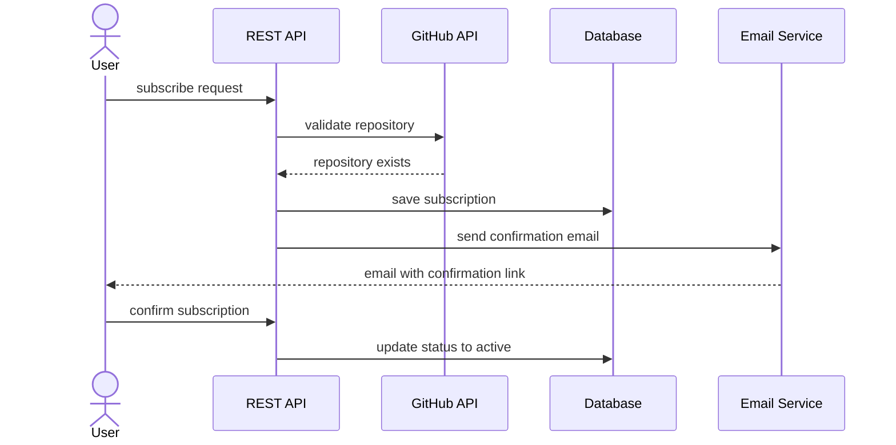
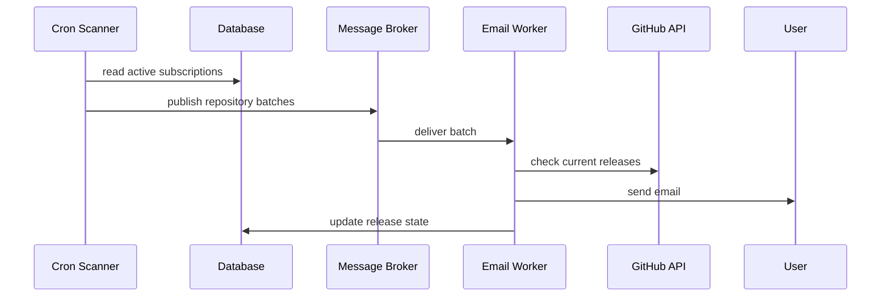

# System Design: Git Release Notifier

## Table of Contents

1. [System Overview](#system-overview)
2. [System Requirements](#system-requirements)
3. [High-Level Architecture](#high-level-architecture)
4. [Components](#components)
5. [Key Flows](#key-flows)
6. [Infrastructure](#infrastructure)

---

## System Overview

Git Release Notifier is a service for tracking new releases of GitHub repositories.
A user subscribes to a repository and receives email notifications whenever a new release appears.

The system automatically scans repositories on a schedule, compares the last known release
with the current one and notifies subscribers only about genuinely new releases.

---

## System Requirements

### Functional Requirements

- A user can subscribe to a GitHub repository and receive a confirmation email
- The system validates the repository existence via GitHub API on subscription
- A user can unsubscribe from a repository via a link in the email
- The scanner regularly checks for new releases for all active subscriptions
- The system sends email notifications when a new release appears
- The system does not send repeated notifications for an already known release
- The system provides an API for viewing all subscriptions by email

### Non-Functional Requirements

- **Reliability:** notifications must not be lost in case of temporary outage of system or system components
- **Security:** all protected endpoints must ensure client identity verification through a secure, standardized authentication mechanism
- **Rate limiting:** system must implement a data-retention strategy for external API responses to ensure continuous operation and compliance with provider-specific quotas, while maintaining acceptable data freshness

### Constraints

- **GitHub API rate limits:** the number of external API requests must be minimised

---

## High-Level Architecture

Component diagram and the relationships between them.



---

## Components

### REST API / gRPC Server

**Responsibility:**
Handles incoming user requests and data validation.

**Technology:**
Fastify + TypeScript.

---

### Cron Scanner

**Responsibility:**
Regularly checks the system state and publishes jobs to the queue.

**Technology:**
Node.js.

---

### Email Worker

**Responsibility:**
Processes jobs from the queue and delivers notifications to users.

**Technology:**
Node.js.

---

### Database

**Responsibility:**
Stores system data.

**Technology:**
PostgreSQL + Prisma ORM.

---

### Cache

**Responsibility:**
Temporary data storage to reduce load on system components.

**Technology:**
Redis.

---

### Message Broker

**Responsibility:**
Reliable job delivery between system components.

**Technology:**
RabbitMQ.

---

## Key Flows

### Flow 1: User Subscription

The user sends a request with their email and repository name.
The API validates the repository existence via the GitHub API, saves the subscription
and sends an email with a confirmation link.
The subscription becomes active only after clicking the link.



---

### Flow 2: Detecting and Sending a New Release

The cron scanner reads active subscriptions from the database and publishes repository batches to the queue. The worker picks up each batch, checks current releases via GitHub API and sends email notifications to subscribers for whom a new release has appeared.



---

## Infrastructure

Local development is run via Docker Compose. All services share a single Docker network
and communicate via service names as hostnames.
Environment variables are configured via `.env` file — see `.env.example` for the full list of required variables.

To spin up the local environment:

```bash
docker compose up -d
npm run prisma:migrate
npm run start:dev
```

CI runs the linter and tests on every push via GitHub Actions.

| Component | Technology | Environment |
|---|---|---|
| API server | Node.js + Fastify | Docker |
| Cron Scanner | Node.js | Docker |
| Database | PostgreSQL | Docker |
| Queue | RabbitMQ | Docker |
| Cache | Redis | Docker |
| CI | GitHub Actions | — |