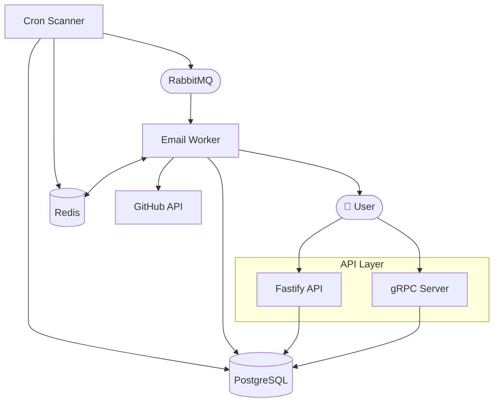
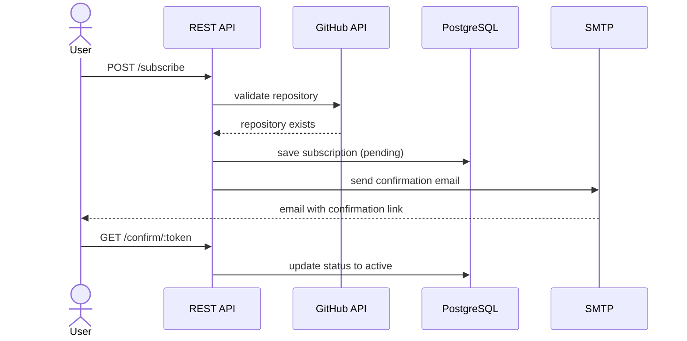
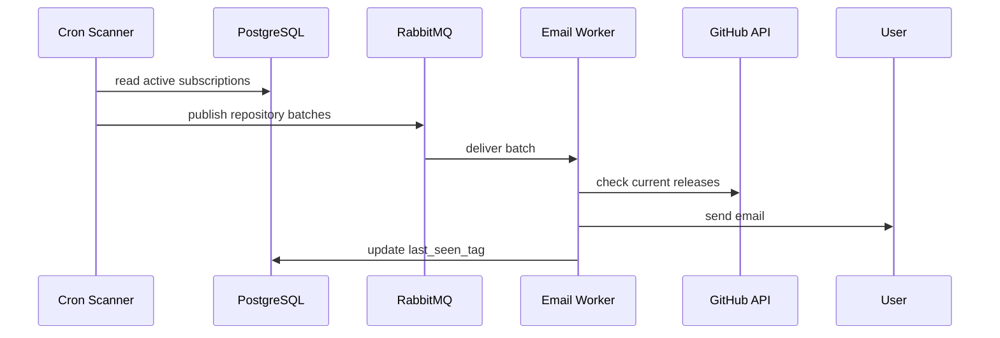

# System Design: Git Release Notifier

## Table of Contents

1. [System Requirements](#system-requirements)
2. [System Overview](#system-overview)
3. [High-Level Architecture](#high-level-architecture)
4. [Components](#components)
5. [Key Flows](#key-flows)
6. [Infrastructure](#infrastructure)

---

### Functional Requirements

- A user can subscribe to a GitHub repository and receive a confirmation email
- The system validates the repository existence via GitHub API on subscription
- A user can unsubscribe from a repository via a link in the email
- The scanner regularly checks for new releases for all active subscriptions
- The system sends email notifications when a new release appears
- The system does not send repeated notifications for an already known release (`last_seen_tag`)
- API for viewing all subscriptions by email (protected by API key)

### Non-Functional Requirements

- **Reliability:** messages will not be lost on RabbitMQ restart —
  the queue and messages are persisted to disk (`durable: true`, `persistent: true`)
- **Security:** protected endpoints require API key authentication via the `x-api-key` header
- **Caching:** GitHub API responses are cached in Redis with a 10-minute TTL
  to reduce the number of external requests

### Constraints

- **GitHub API rate limits:** the scanner groups repositories into batches
  and makes a single GraphQL request per batch instead of one request per repository

---

## System Overview

Git Release Notifier is a service for tracking new releases of GitHub repositories.
A user subscribes to a repository and receives email notifications whenever a new release appears.

The system automatically scans repositories on a schedule, compares the last known release
with the current one and notifies subscribers only about genuinely new releases.

---

## High-Level Architecture

Component diagram and the relationships between them.



## Components

### REST API / gRPC Server

**Responsibility:**
Handles incoming user requests — subscription, confirmation, unsubscription, viewing subscriptions.
Data validation on all endpoints. `GET /subscriptions` requires API key authentication;
all other endpoints are publicly accessible.

**Technology:**
Fastify + TypeScript. gRPC as an alternative interface for the same operations.

---

### Cron Scanner

**Responsibility:**
Regularly reads active subscriptions from the database, groups repositories into batches
and publishes jobs to the RabbitMQ queue. Not responsible for sending emails.

**Technology:**
Node.js cron job. Redis is used for the lock mechanism —
to prevent the same batch from being added to the queue twice.

---

### Email Worker

**Responsibility:**
Reads batches from the queue, makes a GraphQL request to the GitHub API,
compares the current release with `last_seen_tag` and sends emails to subscribers for whom a new release has appeared.
Updates `last_seen_tag` after a successful send.

**Technology:**
Node.js RabbitMQ consumer via `amqplib`. Emails are sent via Nodemailer (SMTP).

---

### PostgreSQL

**Responsibility:**
Stores user subscriptions, confirmation status and `last_seen_tag` for each repository.

**Technology:**
PostgreSQL + Prisma ORM for migrations and data access.

---

### Redis

**Responsibility:**
Caching GitHub API responses with a 10-minute TTL.
Lock mechanism to prevent duplicate batches in the queue.

---

### RabbitMQ

**Responsibility:**
`github-scanner-queue` for transferring batches from the scanner to the worker.
Guarantees that a job will not be lost on restart (`durable: true`, `persistent: true`).

---

## Key Flows

### Flow 1: User Subscription

The user sends a request with their email and repository name.
The API validates the repository existence via the GitHub API, saves the subscription
with a `pending` status and sends an email with a confirmation link.
The subscription becomes active only after clicking the link.



---

### Flow 2: Detecting and Sending a New Release

The cron scanner reads active subscriptions from the database and publishes repository batches to the queue. The worker picks up each batch, checks current releases via GitHub API and sends email notifications to subscribers for whom a new release has appeared.



---

## Infrastructure

Local development is run via Docker Compose. All services share a single Docker network
and communicate via service names as hostnames.
Environment variables are configured via `.env` file — see `.env.example` for the full list
of required variables including `DATABASE_URL`, `REDIS_URL`, `RABBITMQ_URL`, `GITHUB_TOKEN` and SMTP credentials.

To spin up the local environment:

```bash
docker compose up -d
npm run prisma:migrate
npm run start:dev
```

CI runs the linter and tests on every push via GitHub Actions.

| Component | Technology | Environment |
|---|---|---|
| API server | Node.js + Fastify | Docker |
| Cron Scanner | Node.js | Docker |
| Database | PostgreSQL | Docker |
| Queue | RabbitMQ | Docker |
| Cache | Redis | Docker |
| CI | GitHub Actions | lint + tests on push |